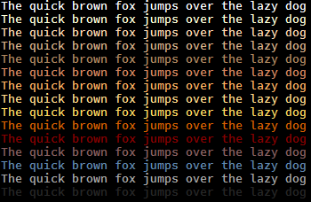

Fahrenheit colorscheme for Vim:

- Base16 theme for the standard 256-color palette of most terminals
- Terminal & GUI support
- Simple, clean code created with [RNB](https://gist.github.com/5cd2f4ec222805f49eca.git)
- Airline, Lightline & CtrlP support out-of-the-box

Screenshots
------------
Taken on minTTY with Office Code Pro font:

[](img/fahrenheit_vim.png)


Palette
--------


|  Hex  | Term |
|-------|-----:|
|#ffffff|    15|
|#ffffd7|   230|
|#ffd7af|   223|
|#d7af87|   180|
|#af875f|   137|
|#d7875f|   173|
|#ffaf5f|   215|
|#ffd787|   222|
|#ffd75f|   221|
|#d75f00|   166|
|#870000|    88|
|#875f5f|    95|
|#5f87af|    67|
|#a8a8a8|   248|
|#262626|   235|
|#000000|     0|
                
Installation
-------------
1. Install the bundle:
  *  [Pathogen][1] - `git clone https://github.com/fcpg/vim-fahrenheit ~/.vim/bundle/vim-fahrenheit`
  *  [NeoBundle][2] - `NeoBundle 'fcpg/vim-fahrenheit'`
  *  [Vundle][3] - `Plugin 'fcpg/vim-fahrenheit'`
  *  [Plug][4] - `Plug 'fcpg/vim-fahrenheit'`
  *  manual - copy all files into your `~/.vim` directory
2. Append the following line to your .vimrc file:
```VimL
colorscheme fahrenheit
```

FAQ
----
- How do I customize colors?  
  *  Either edit the 'colors/fahrenheit.vim' file (it's plain vim 'highlight' commands), if you don't mind merging when pulling/updating;
  *  Or override with autocommands in you .vimrc:
```VimL
augroup myBetterColors
  au!
  autocmd ColorScheme *  hi! Number ctermfg=103
augroup END
```
- Some weird chars show up in my status line!  
  Check vim help for 'fillchars': `:h 'fcs`. The lightline theme use the 'stl'
  char in 'fillchars' if it is defined; unset it in your .vimrc to turn on the 
  "solid" status line.
  
Resources
----------
- Included in this repo ('misc' subdir):
  - Shell script for terminal settings (generic OSC commands)
  - .Xresources
  - .minttyrc
  - .dir_colors
- [iTerm2 colorscheme](https://github.com/mbadolato/iTerm2-Color-Schemes/blob/master/schemes/Fahrenheit.itermcolors)

Other Themes
-------------
- [Far Out](https://github.com/fcpg/vim-farout)
- [Orbital](https://github.com/fcpg/vim-orbital)

License
--------
[Attribution-ShareAlike 4.0 Int.](https://creativecommons.org/licenses/by-sa/4.0/)

[1]: https://github.com/tpope/vim-pathogen
[2]: https://github.com/Shougo/neobundle.vim
[3]: https://github.com/gmarik/vundle
[4]: https://github.com/junegunn/vim-plug
